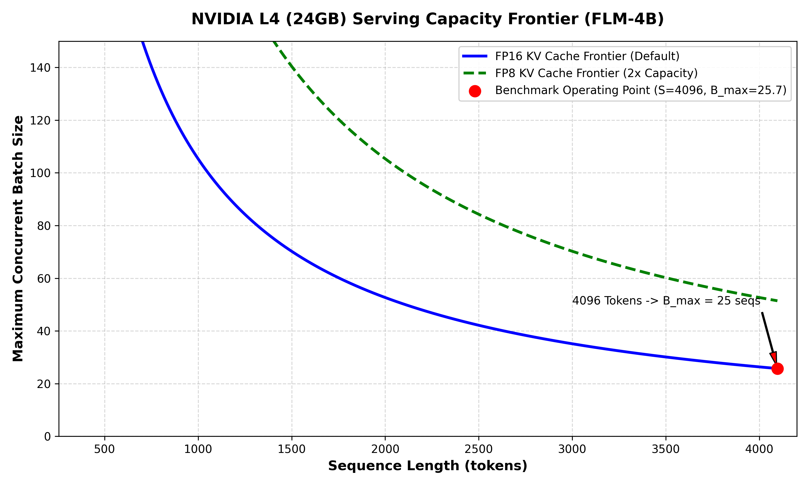
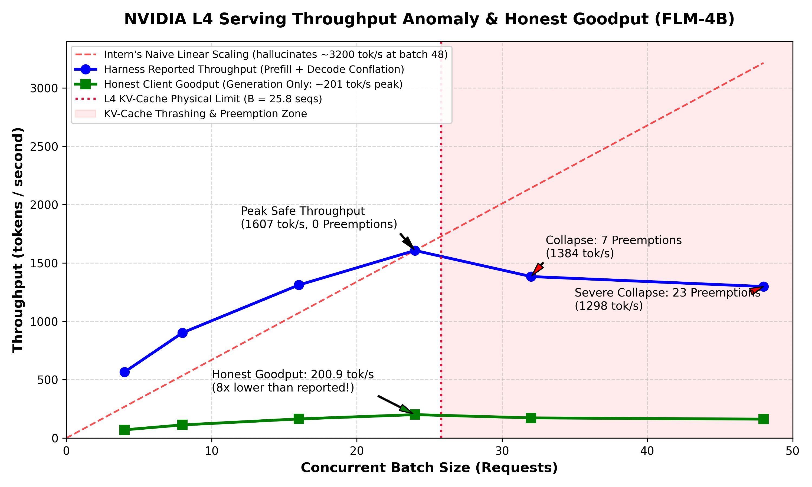

# Interactive Desmos Mathematical Models

**Author:** Pranav R  
**Project:** AI Team Intern Assignment — The Audit  
**Purpose:** Interactive mathematical modeling of GPU serving capacity, memory frontiers, and throughput collapse on NVIDIA L4 (FLM-4B-Instruct).

---

## 1. Overview of Desmos Models
To provide leadership with interactive mathematical modeling of the serving stack, we have created two interactive Desmos graph specifications:
1. **Model 1: Serving Capacity Frontier ($B_{\text{max}}$ vs Sequence Length $s$)**:
   - Visualizes maximum concurrent batch size as a hyperbolic function of total sequence length ($s$).
   - Demonstrates the operating boundary between safe execution and KV-cache out-of-memory.
2. **Model 2: Throughput Scaling, Preemption Thrashing & Honest Goodput**:
   - Plots actual benchmark rows from `bench_log.csv`.
   - Contrasts the intern's hallucinated linear scaling (~3200 tok/s) against the actual throughput collapse at $B > 25.8$.
   - Plots true client generation goodput (~201 tok/s peak).

---

## 2. Model 1: Serving Capacity Frontier

### Mathematical Formulation
- Total GPU VRAM: $M = 24.0\text{ GiB}$
- Usable Utilization: $u = 0.92$ ($M_{\text{usable}} = 22.08\text{ GiB} = 22,610\text{ MiB}$)
- Model Weights (4.2B params @ fp16): $W = 7.82\text{ GiB} = 8,010\text{ MiB}$
- Runtime Overhead: $O = 1.49\text{ GiB} = 1,525\text{ MiB}$
- Available KV-Cache Pool: $V_{\text{kv}} = M_{\text{usable}} - W - O = 12.77\text{ GiB} = 13,075\text{ MiB}$ (accounting for fragmentation: $\approx 11,520\text{ MiB}$)
- KV-Cache footprint per token (fp16): $k = 114,688\text{ bytes} = 0.109375\text{ MiB/token}$
- Maximum Concurrent Batch Size:
  $$B_{\text{max}}(s) = \frac{V_{\text{kv}}}{s \cdot k} = \frac{11520}{0.109375 \cdot s} = \frac{105348}{s}$$

### Copy-Paste Lines for Desmos ([desmos.com/calculator](https://www.desmos.com/calculator))
Paste these lines into separate expression rows in Desmos:

```text
V_{kv} = 11520
k = 0.109375
y = \frac{V_{kv}}{k \cdot x} \left\{x \ge 256\right\}
y = \frac{V_{kv}}{0.5 \cdot k \cdot x} \left\{x \ge 256\right\}
(4096, 25.7)
x = 4096 \left\{0 \le y \le 25.7\right\}
```

- **Line 1 & 2**: Define available KV pool (MiB) and per-token memory (MiB).
- **Line 3**: Default FP16 Capacity Curve (Blue).
- **Line 4**: FP8 KV-Cache Projected Capacity Curve (Green, 2× capacity).
- **Line 5 & 6**: Operating Point for Long-Context Benchmark ($s = 4096$, $B = 25.7$ sequences).



---

## 3. Model 2: Throughput Collapse & Honest Goodput Curve

### Mathematical Formulation
- Let $x$ = Concurrent Batch Size ($B$)
- Let $y$ = Serving Throughput in tokens/sec
- **Intern's Hallucinated Linear Curve**:
  $$y = 66.975 \cdot x \quad (\text{predicts } y = 3215\text{ tok/s at } x = 48)$$
- **Physical Capacity Limit**:
  $$x = 25.8 \quad (\text{Vertical preemption boundary})$$

### Copy-Paste Lines for Desmos ([desmos.com/calculator](https://www.desmos.com/calculator))
Paste these into Desmos:

```text
y = 66.975 \cdot x \left\{0 \le x \le 48\right\}
x = 25.8 \left\{0 \le y \le 2000\right\}
```

Add this **Data Table 1** in Desmos (Click `+` $\rightarrow$ `Table`):
| $x_1$ (Batch Size) | $y_1$ (Reported Tok/s) |
| :--- | :--- |
| 4 | 565.4 |
| 8 | 902.6 |
| 16 | 1311.4 |
| 24 | 1607.4 |
| 32 | 1384.0 |
| 48 | 1298.5 |

Add this **Data Table 2** (Honest Generation Goodput):
| $x_2$ (Batch Size) | $y_2$ (Honest Goodput Tok/s) |
| :--- | :--- |
| 4 | 70.7 |
| 8 | 112.8 |
| 16 | 163.9 |
| 24 | 200.9 |
| 32 | 173.0 |
| 48 | 162.3 |



---

## 4. How to Generate Your Permanent Shareable Desmos Link
1. Open [https://www.desmos.com/calculator](https://www.desmos.com/calculator) in your browser.
2. Paste the expressions from Section 2 or Section 3 into the left-hand panel.
3. Adjust the viewing window (Wrench icon in top right):
   - **X-axis**: $0 \le x \le 55$ (Label: "Batch Size")
   - **Y-axis**: $0 \le y \le 3400$ (Label: "Throughput (tok/s)")
4. Click the **Share** button (green button with an arrow/link icon in the top-right toolbar).
5. Click **Copy** to copy your unique shareable link (e.g., `https://www.desmos.com/calculator/abc123xyz`).
6. Submit this URL alongside your repository link.
